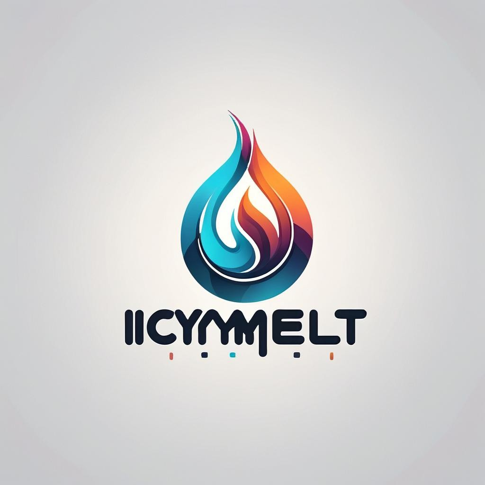

#  🧊 IcyMelt ❄️

### Project from 01219335 - Data Acquisition and Integration

## Team members
Department of Software and Knowledge Engineering, Kasetsart University
1. Phiranat  Chaleekul   6510545659
2. Kantaphat Phaphui     6510545268

---

    
    
Generated by <a href="https://gencraft.com/generate">Gencraft</a>

This project measures the rate of ice melting. For example, if the temperature and humidity are at certain levels, how long will it take for the ice to melt? 
  
  To conduct experiments, we will place the ice on various surfaces such as metal, soil, plastic, and wood.

### See the [Project Structure](project_structure.md) for more details.

### See the [Project Installation](project_installation.md) to set up the project.

### See the [API Reference](api_reference.md) document.

---

## References

- Web Template: [tooplate](https://www.tooplate.com/view/2135-mini-finance)
- Logo AI Generated by: [Gencraft](https://gencraft.com/generate)